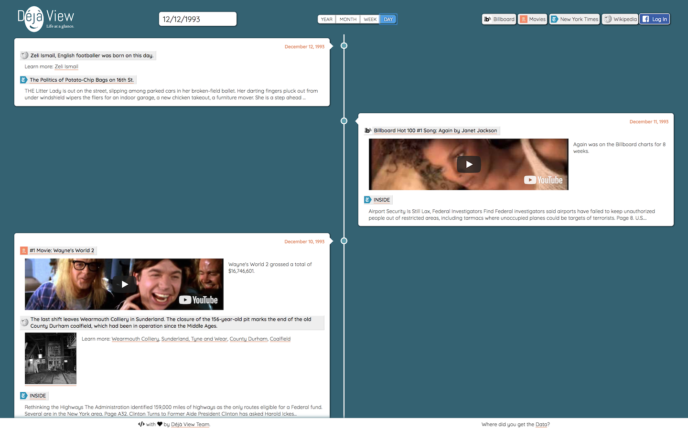

# Déjà View

This was created during our time as students at [Code Chrysalis](https://www.codechrysalis.io/).

This app is hosted at http://www.dejaview.cc/.

The data scraping code for this app can be found at https://github.com/xzjia/dejaview-scraper.

## What is Déjà View?

Looking back over the events of our digital lives can be cumbersome. _Déjà View_ is a web application that allows you to see events during your life (and before) in a given time frame. By combining publicly available information and a user's social media feed we created a unique experience not available anywhere else.

<p align="center">

</p>

## How to use it

- Choose a date from the date selector.
  - You will see a series of _cards_ from that date.
- Choose a _granularity_ (YEAR, MONTH, WEEK, DAY).
  - Each _card_ represents one YEAR, MONTH, WEEK, or DAY.
- Navigate forward and backward.
  - Use the date selector
- Choose what kind of events that you want to see.
  - By default, events from all available data sources are shown.
  - Click on the _data source filters_ (Billboard, Movies, etc.) to hide or show certain data sources.
- Log in to Facebook to show your posts from Facebook.

  - _We are currently in the process of getting approval from Facebook. If you would like to be a *tester* for this app, please [let us know](http://www.dejaview.cc/about)._

# For Developers

## Getting Started

### Prerequisites

You will need [Node.js](https://nodejs.org/) installed with a package manger such as [yarn](https://yarnpkg.com/lang/en/) and a PostgreSQL database available locally to install.

After starting PostgreSQL, create a database from the command line

```
createdb dejaview
```

#### Create a Facebook App

You can [create a Facebook App](https://developers.facebook.com/docs/apps/register) for free. Once you've created an App, you'll need the app ID and app secret. If you want to use the application without facebook integration you can skip this step.

#### Set the callback URL

You'll need to set the URL that Facebook Login will come back to after a successful login. This should be the root domain of the place where your app is running. For development localhost will work. If you want to use the application without facebook integration you can skip this step.

### Environment Variables

This app uses environment variables to load keys from your environment. These should be placed in a file in the root directory named `.env`

```
FACEBOOK_APP_ID=<Your APP ID>
FACEBOOK_APP_SECRET=<Your SECRET KEY>
DATABASE_URL=postgresql://localhost/dejaview
FACEBOOK_APP_CALLBACK_URL=http://localhost:3001/auth/facebook/callback
```

### Installing

Run yarn to install of the node module dependencies required by the application.

```
yarn
```

Then populate the database using knex.

```
knex migrate:latest
knex seed:run
```

See the [dejaview schema](documentation/dbschema.png) for details on the database. Some sample records are loaded when seeding the database, but for more information on how the data was loaded into the original application look at the [Deja View Scraper Project](https://github.com/xzjia/dejaview-scraper)

Run yarn start to run the application on port 3001.

```
yarn start
```

You can now view the application at http://localhost:3001/

You can view the events raw information using _Deja View's_ REST API:

```
http://localhost:3001/api/v1/2018-06-26/?granularity=days&num=10
```

See [API documentation](documentation/API.md) for more information

## Running the tests

Current Test checks to make sure App renders

```
yarn test
```

## Built With

- [React.js](https://reactjs.org/) - Front end library
- [Node.js](https://nodejs.org/en/) - Back end server
- [Express](https://expressjs.com/) - Web framework
- [knex.js](https://knexjs.org/) - SQL Query Builder
- [PostgreSQL](https://www.postgresql.org/) - Relational Database
- [Font Awesome](https://fontawesome.com/) - Icon Library
- [axios](https://github.com/axios/axios) - Promise based HTTP client
- [Passport](http://www.passportjs.org/) - Authentication library
- [ReactPlayer](https://www.npmjs.com/package/react-player) - React Component for playing YouTube videos
- [Moment.js](https://momentjs.com/) - Date Manipulation
- [React Infinite Scroller](https://www.npmjs.com/package/react-infinite-scroller) - React Component for Scrolling

## Authors

Original Authors on this project

- **Beau Dobbin** - [beaunus](https://github.com/beaunus)
- **Mike Donnelly** - [SQLMD](https://github.com/SQLMD)
- **Jia Xiaozhou** - [xzjia](https://github.com/xzjia)

See also the list of [contributors](https://github.com/beaunus/dejaview/contributors) who participated in this project.

## License

This project is licensed under the MIT License - see the [LICENSE](documentation/LICENSE.md) file for details

## Acknowledgments

- Thank you to [Tim Urban](https://waitbutwhy.com/2014/05/life-weeks.html/) for the inspiration to look at the weeks of our lives.
- Thank you to [Facebook](https://developers.facebook.com/docs/graph-api/) for their Graph API.
- Thenk you to our public [data sources](http://www.dejaview.cc/data.html) (New York Times, Wikipedia, The-Numbers, and Billboard)
- Thank you to [Code Chrysalis](https://www.codechrysalis.io/), without you this project wouldn't exist.
